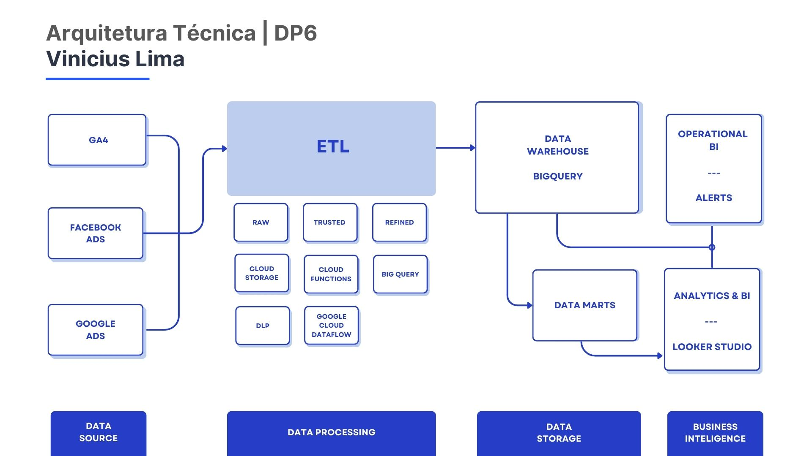
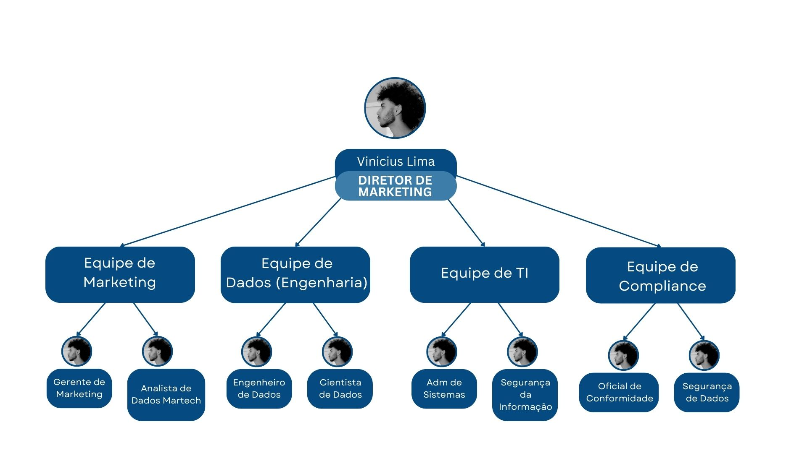

  # Teste Técnico - Engenharia de Dados

### Cenário

A DP6 está colaborando com um cliente do setor de varejo que opera e-commerce e aplicativos nativos. O foco é aprimorar as operações de marketing, incluindo coleta de dados, criação de dashboards e integração de informações.

**Dores Identificadas:**

1. O cliente deseja monitorar o desempenho de campanhas no Facebook e Google em tempo real, em vez de semanalmente, utilizando dados do Google Analytics. É necessária a criação de dashboards diários para melhor escalabilidade.
2. As agências de marketing do cliente precisam acessar dados internos para gerar relatórios, mas o compartilhamento deve ser seguro, respeitando as leis de proteção de dados e garantindo a proteção de informações pessoais.

O candidato deve propor soluções técnicas para resolver as dores do cliente, considerando boas práticas de gestão e arquitetura de dados. É importante que as soluções atendam as necessidades das áreas de dados das empresas e que o consultor considere alternativas que beneficiem o cliente de forma mais eficaz.

---

## A. Arquitetura Técnica:

O diagrama ilustra o fluxo de dados de diversas fontes (Google Analytics, Facebook Ads, Google Ads) sendo processados e consolidados no BigQuery, e o fluxo de dados para ferramentas de BI (Looker Studio) ou integração segura com agências externas.

Fluxo de Comunicação:
- Google Analytics: Captura dados de conversão e envia via API para o Cloud Functions.
- Facebook Ads / Google Ads API: Dados de desempenho das campanhas são coletados automaticamente pelas Cloud Functions.
- Cloud Functions: Realiza a ingestão de dados, que são enviados para o Google Cloud Dataflow para processamento.
- Google Cloud Dataflow: Transforma e enriquece os dados, enviando o resultado para o BigQuery.
- BigQuery: Armazena os dados e fornece acesso ao Looker Studio para visualização e relatórios.
- Cloud Pub/Sub: Facilita a comunicação em tempo real entre os componentes, gerenciando eventos de maneira assíncrona.

## B. Componentes Escolhidos

| **Componente**               | **Propósito**                                                                                                           | **Documentação**                                               |
|------------------------------|-------------------------------------------------------------------------------------------------------------------------|---------------------------------------------------------------|
| **Google Analytics (GA4)**   | Captura dados de conversão de e-commerce, permitindo o rastreamento do comportamento dos usuários e a análise de performance de campanhas. | [Documentação](https://developers.google.com/analytics/devguides/collection/ga4?hl=pt-br) |
| **Facebook Ads / Google Ads API** | Captura dados de performance de campanhas publicitárias nas plataformas Facebook e Google, facilitando o monitoramento de métricas como CPA e ROAS.        | [Facebook Ads API](https://developers.facebook.com/docs/marketing-api) / [Google Ads API](https://developers.google.com/google-ads/api/docs/start) |
| **Cloud Functions**          | Executa funções serverless para ingestão automática e periódica dos dados de campanhas, permitindo a automação de tarefas sem a necessidade de gerenciar servidores.                                   | [Documentação](https://cloud.google.com/functions/docs)        |
| **Cloud Storage**            | Armazenamento escalável para arquivos brutos ou pré-processados, garantindo acessibilidade e durabilidade dos dados.      | [Documentação](https://cloud.google.com/storage/docs)          |
| **Google Cloud Dataflow**    | Processamento de dados em larga escala (ETL) para transformar e enriquecer dados, permitindo a execução de pipelines de dados em tempo real e em batch.                                        | [Documentação](https://cloud.google.com/dataflow/docs)        |
| **BigQuery**                 | Armazenamento e processamento de grandes volumes de dados, permitindo consultas SQL rápidas e análise de dados em tempo real. | [Documentação](https://cloud.google.com/bigquery/docs)       |
| **Looker**                   | Plataforma de BI para a criação de dashboards interativos e relatórios, possibilitando a visualização de métricas de performance (CPA/ROAS) em tempo real.                                   | [Documentação](https://cloud.google.com/looker/docs)         |
| **Cloud IAM**                | Gerencia identidades e permissões de acesso aos dados, garantindo que apenas usuários autorizados possam acessar informações sensíveis. | [Documentação](https://cloud.google.com/iam/docs)            |
| **Data Loss Prevention (DLP)** | Protege dados sensíveis (PIIs) e garante conformidade com leis de proteção de dados, identificando e ocultando informações confidenciais.                                     | [Documentação](https://cloud.google.com/dlp/docs)            |
| **Cloud Pub/Sub**            | Serviço de mensageria que permite a comunicação e orquestração de dados em tempo real, possibilitando a ingestão e processamento de eventos de maneira assíncrona.                                   | [Documentação](https://cloud.google.com/pubsub/docs)         |

## C. Defesa da Solução Apresentada 

**Escalabilidade e Performance:**

- O BigQuery é ideal para lidar com grandes volumes de dados de múltiplas fontes, com consultas SQL rápidas e eficientes. É escalável e suporta análises complexas.
- Cloud Functions automatiza o processo de ingestão de dados das APIs (Facebook Ads, Google Ads), permitindo a criação de pipelines leves e customizados, com uma integração fácil e custo-benefício eficiente. 
- O Google Cloud Dataflow é uma alternativa robusta caso o volume de dados aumente consideravelmente, especialmente para processamento em tempo real.

**Automatização de Dashboards:**

- Com a integração do BigQuery com o Looker Studio, é possível fornecer relatórios diários automatizados, eliminando a necessidade de geração manual por parte do BI.
- Os data marts serão criados para organizar dados relevantes, permitindo que as agências acessem apenas as informações necessárias para avaliar o desempenho de campanhas, como CPA e ROAS. Isso otimiza a eficiência nas análises e fornece insights direcionados para decisões rápidas e informadas.

**Modelo de Custo Flexível:**

- A infraestrutura em nuvem permite que o cliente pague apenas pelos recursos que realmente utiliza, como armazenamento, processamento e consultas, resultando em um modelo de custo flexível e escalável. Isso significa que, à medida que a demanda por dados cresce, o custo se ajusta conforme necessário, sem grandes investimentos iniciais.

**Segurança e Privacidade:**

- Cloud IAM e Data Loss Prevention garantem que apenas usuários autorizados tenham acesso a dados sensíveis, minimizando riscos.
- A implementação de monitoramento contínuo e testes regulares garante a qualidade dos dados, assegurando que as informações fornecidas sejam sempre precisas e atualizadas

**Qualidade e Confiabilidade:**

- O controle rigoroso de qualidade dos dados, combinado com a capacidade de monitoramento do Stackdriver, proporciona uma infraestrutura confiável e robusta, que atende às necessidades do cliente de forma consistente.

## D. Premissas do Cliente 

- **Acesso às APIs e Dados:** O cliente deve garantir acesso adequado e contínuo às APIs do Google Analytics, Facebook Ads e Google Ads, com credenciais atualizadas e gerenciadas pela equipe de TI para evitar interrupções no fluxo de dados.
- **Colaboração da Equipe de TI:** A equipe de TI deve estar envolvida desde o início na configuração das permissões de acesso, na implementação de políticas de segurança e na integração das ferramentas. Devem ser definidos pontos de contato claros entre as equipes para facilitar a comunicação e a resolução de problemas.
- **Treinamento e Capacitação:** A equipe de marketing deve participar de sessões de treinamento sobre as ferramentas e dashboards, incluindo tutoriais sobre como interpretar os dados e utilizar as funcionalidades de filtragem e visualização. Além disso, devem ser disponibilizados materiais de suporte, como guias e FAQs.
- **Compliance e Segurança de Dados:** Garantir que todas as práticas de acesso e compartilhamento de dados estejam em conformidade com as leis de proteção de dados (como LGPD/GDPR). Um responsável pela conformidade deve ser designado para revisar regularmente as práticas de segurança.

## D. Estrutura Organizacional Proposta 

O organograma apresenta os níveis hierárquicos da estrutura organizacional alinhada às necessidades do projeto. As equipes de Marketing, Dados, TI e Compliance desempenham papéis essenciais na gestão e análise de dados, assegurando colaboração eficiente e conformidade com regulamentações. 

Equipe de Marketing:

- Responsabilidades: Definir KPIs, colaborar na criação de dashboards, analisar dados e relatar resultados.
- Pontos de Contato: Gerente de Marketing, Analistas de Dados de Marketing.

Equipe de Dados (Engenharia de Dados):
- Responsabilidades: Implementar e gerenciar a infraestrutura de dados, garantir a qualidade dos dados, desenvolver ETL, manter dashboards.
- Pontos de Contato: Engenheiro de Dados, Cientista de Dados.

Equipe de TI:
- Responsabilidades: Gerenciar o acesso às ferramentas e APIs, implementar políticas de segurança, oferecer suporte técnico.
- Pontos de Contato: Administrador de Sistemas, Especialista em Segurança da Informação.

Equipe de Compliance:
- Responsabilidades: Garantir que as práticas de dados estejam em conformidade com as leis de proteção de dados (LGPD/GDPR), revisar políticas de privacidade.
- Pontos de Contato: Oficial de Conformidade, Consultor de Segurança de Dados.

Consultoria Externa (se necessário):
- Responsabilidades: Fornecer insights adicionais, suporte na integração de ferramentas e na análise de dados.
- Pontos de Contato: Consultor de Marketing Digital, Especialista em Análise de Dados.

## E. Boas Práticas de Implementação 

- Segurança de Dados: Aplicar Cloud DLP e IAM: É essencial seguir o princípio de menor privilégio na concessão de acessos. Devemos criptografar dados sensíveis tanto em repouso quanto em trânsito para garantir a segurança e conformidade legal.
- Estabelecer Alertas no Google Cloud Billing: Vamos monitorar os gastos em tempo real para evitar surpresas. Utilizaremos o Reservation Pricing do BigQuery para otimizar a utilização de recursos.
- Configurar Google Cloud Monitoring: Precisamos implementar um sistema de monitoramento contínuo. Alertas para falhas, latência e desempenho serão cruciais, assim como dashboards em tempo real para a equipe de marketing.
- Estabelecer Ciclos de Feedback com a Equipe de Marketing: Precisamos realizar reuniões regulares para discutir métricas de desempenho e ajustar as estratégias de coleta e análise de dados.
- Promover uma Cultura de Dados: É fundamental incentivar a equipe a usar dados para tomar decisões. Fomentaremos a alfabetização em dados, treinando a equipe de marketing sobre como interpretar relatórios e dashboards, tornando-os mais autônomos na análise de resultados

## Conecte-se comigo no [LinkedIn](https://www.linkedin.com/in/viunicius/)
